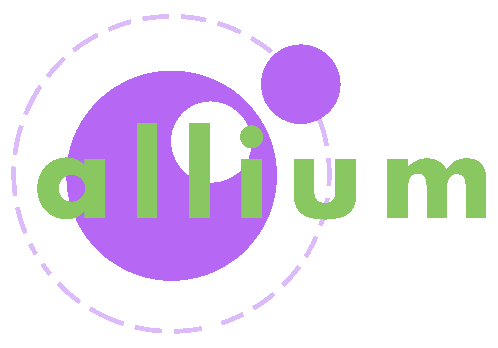
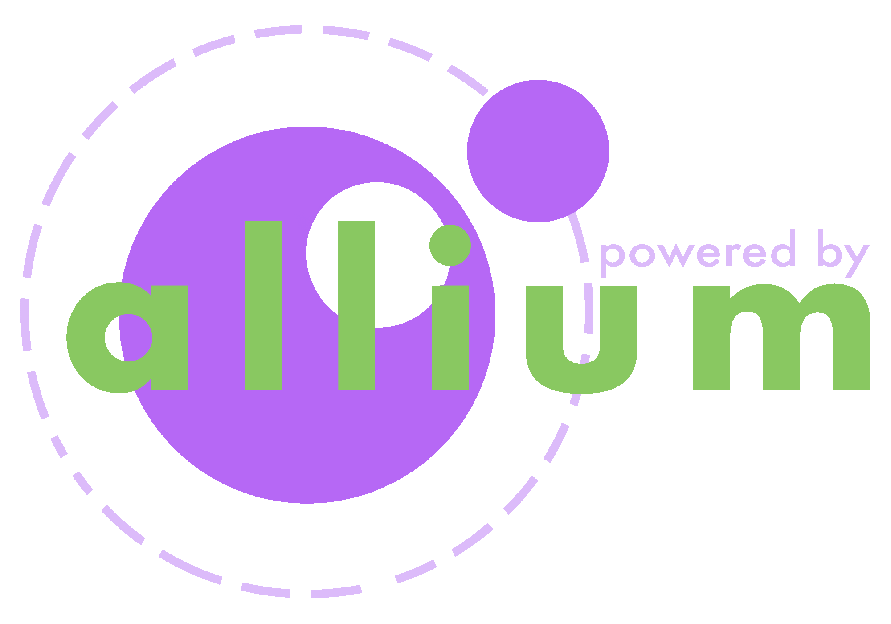

# 

  

Lua script loader & toolchain for Java Minecraft.

Currently, only functioning and in development in Fabric, with the intent of supporting Forge/Quilt later on down the road.

## Installing
Allium installs just like any other Fabric mod. If you don't know how to do this, [this Tech Insider video](https://www.youtube.com/watch?v=vNz0z1Aht1U) does a pretty good job of explaining how.

### Scripts
In the same place that you create your `mods` directory, create a folder named `allium`. This is where your lua scripts will go. They may come in the form of a `.zip`, but may be expanded, and put into a regular directory if you'd like to tinker with them. If you're at all familiar with the Resource/Data Pack structure, then you'll know that this is similar.

## Examples
Sometimes the best way to learn is by example, this is especially true for understanding how to structure Allium scripts. You can find these demonstrations in the `examples` directory. If you'd like to play with these scripts yourself, simply drag and drop them into your `allium` directory. If you're working in a development environment, example scripts get automatically loaded when you launch the client, no need to do any file movement!

## Logos
Allium's logos are under the same license as the rest of the project. Feel free to use these in your own project

  

## Too much Allium...
Since 2018 a project under the name Allium has existed. This is being addressed to suppress the Mandela Effect.

### Isn't Allium for ComputerCraft?
Allium for CC has been moved to [allium-cc](https://github.com/hugeblank/allium-cc). This project took it's original repository location due to it being a far more useful successor to the CC variant.

### Isn't Allium a peripheral mod for ComputerCraft?
That's Allium Peripherals. You can check it out [here](https://github.com/hugeblank/allium-peripherals).
